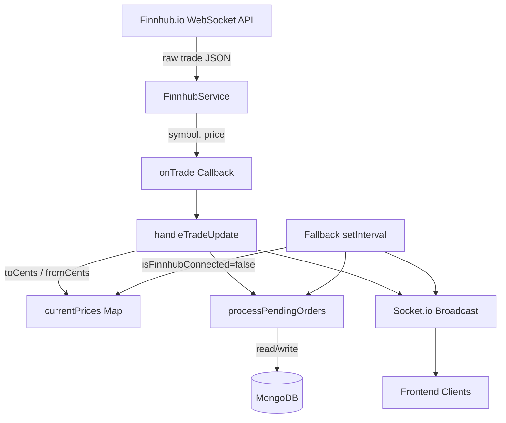
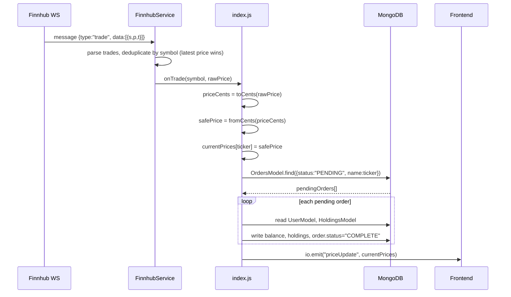

# Design Document: Finnhub WebSocket Integration

## Overview

This feature replaces the `setInterval`-based random-walk price simulation in the ArthaOdha Engine service (port 3002) with a live, event-driven hybrid integration using the Finnhub.io WebSocket API. The `FinnhubService` manages the persistent WebSocket connection, subscribes to a hardcoded watchlist of 40 tickers (within the free-tier 50-symbol limit), and emits trade events that drive both the order-matching engine and Socket.io price broadcasts. A resilient fallback automatically resumes the internal simulation whenever the Finnhub connection is unavailable.

The design preserves all existing financial-math invariants: every price received from Finnhub is immediately converted to integer cents via `toCents()` before touching any database write or order-matching comparison, and converted back to a decimal via `fromCents()` only at the API response boundary.

---

## Architecture



---

## Sequence Diagrams

### Happy Path: Live Trade Event → Order Match → Broadcast



### Reconnection & Fallback

```mermaid
sequenceDiagram
    participant FS as FinnhubService
    participant IDX as index.js
    participant FB as Fallback Timer

    FS->>IDX: onStatusChange(false)
    IDX->>IDX: isFinnhubConnected = false
    FB->>IDX: tick every 2 s
    IDX->>IDX: simulate random-walk for all stock tickers
    IDX->>IDX: processPendingOrders() (all tickers)
    IDX->>IDX: io.emit("priceUpdate", currentPrices)
    FS->>FS: exponential backoff reconnect
    FS->>IDX: onStatusChange(true)
    IDX->>IDX: isFinnhubConnected = true
    Note over FB,IDX: Fallback simulation stops for stocks; Finnhub drives prices again
```

---

## Components and Interfaces

### Component 1: FinnhubService (`backend/FinnhubService.js`)

**Purpose**: Owns the entire lifecycle of the Finnhub WebSocket connection — authentication, subscription management, heartbeat/ping, and exponential-backoff reconnection.

**Interface**:
```javascript
class FinnhubService {
  /**
   * @param {string} apiKey          - Finnhub API key from env
   * @param {string[]} symbols       - Unique external symbols to subscribe (max 40)
   * @param {Function} onTrade       - Callback: (symbol: string, price: number) => Promise<void>
   * @param {Function} onStatusChange - Callback: (connected: boolean) => void
   */
  constructor(apiKey, symbols, onTrade, onStatusChange) {}

  /** Opens the WebSocket and begins subscription */
  connect() {}

  /** Gracefully closes the connection and cancels reconnect timers */
  disconnect() {}

  /** Returns true if the socket is currently OPEN */
  get isConnected() {}
}
```

**Responsibilities**:
- Connect to `wss://ws.finnhub.io?token=<apiKey>`
- On `open`: send `{"type":"subscribe","symbol":"<s>"}` for each symbol
- On `message`: parse JSON, handle `type === "trade"` and `type === "ping"`
- On `close` / `error`: call `onStatusChange(false)`, schedule reconnect with exponential backoff (1 s → 2 s → 4 s … capped at 30 s)
- On successful reconnect: re-subscribe all symbols, call `onStatusChange(true)`
- Send a WebSocket ping every 30 s to keep the connection alive

---

### Component 2: Trade Handler (`handleTradeUpdate` in `backend/index.js`)

**Purpose**: Bridge between raw Finnhub trade events and the internal price/order system.

**Interface**:
```javascript
/**
 * @param {string} symbol   - External Finnhub symbol, e.g. "INFY.NS"
 * @param {number} rawPrice - Raw floating-point price from Finnhub
 * @returns {Promise<void>}
 */
async function handleTradeUpdate(symbol, rawPrice) {}
```

**Responsibilities**:
- Resolve `symbol` → one or more internal tickers via `watchlistMap`
- Apply `toCents()` → `fromCents()` round-trip to sanitise the price
- Update `currentPrices[ticker]`
- Call `processPendingOrders(ticker)` for targeted, event-driven matching
- Emit `io.emit("priceUpdate", currentPrices)` immediately

---

### Component 3: Order Matching Engine (`processPendingOrders` in `backend/index.js`)

**Purpose**: Scans pending limit orders for a given ticker (or all tickers) and executes those whose price condition is now met.

**Interface**:
```javascript
/**
 * @param {string|null} targetTicker - Internal ticker to filter on, or null for all
 * @returns {Promise<void>}
 */
async function processPendingOrders(targetTicker = null) {}
```

**Responsibilities**:
- Query `OrdersModel` for `{ status: "PENDING", ...(targetTicker && { name: targetTicker }) }`
- For each order, compare `currentPrices[order.name]` against `order.price`
- Execute BUY if `currentPrice <= order.price` and user has sufficient balance
- Execute SELL if `currentPrice >= order.price` and user holds sufficient quantity
- Update `HoldingsModel`, `UserModel.balance`, and `order.status` atomically per order
- All arithmetic via `toCents()` / `fromCents()`

---

### Component 4: Hybrid Fallback Timer (`setInterval` in `backend/index.js`)

**Purpose**: Ensures the system remains functional and responsive when Finnhub is unavailable.

**Responsibilities**:
- Always simulate NIFTY 50 and SENSEX (indices not available on free tier)
- When `isFinnhubConnected === false`: apply random-walk to all stock tickers and call `processPendingOrders()`
- Always emit `io.emit("priceUpdate", currentPrices)` every 2 s (provides a heartbeat to the frontend even when Finnhub is live, ensuring indices stay updated)

---

## Data Models

### Watchlist Map

```javascript
// Maps internal display tickers → Finnhub NSE symbols
// Kept to 40 entries to stay safely under the free-tier 50-symbol limit
const WATCHLIST = [
  "INFY", "TCS", "RELIANCE", "BHARTIARTL", "HDFCBANK",
  "ITC", "TATAPOWER", "WIPRO", "M&M", "HINDUNILVR",
  "SBIN", "KPITTECH", "QUICKHEAL", "ONGC", "ICICIBANK",
  "AXISBANK", "KOTAKBANK", "LT", "BAJFINANCE", "MARUTI",
  "SUNPHARMA", "DRREDDY", "CIPLA", "DIVISLAB", "NESTLEIND",
  "TITAN", "ULTRACEMCO", "ASIANPAINT", "BAJAJFINSV", "TECHM",
  "HCLTECH", "POWERGRID", "NTPC", "COALINDIA", "GRASIM",
  "JSWSTEEL", "TATASTEEL", "HINDALCO", "ADANIENT", "ADANIPORTS"
];

const watchlistMap = {
  "INFY":       "INFY.NS",
  "TCS":        "TCS.NS",
  "RELIANCE":   "RELIANCE.NS",
  // ... (one entry per ticker, 40 total)
  "HUL":        "HINDUNILVR.NS",  // alias: both HUL and HINDUNILVR map to same Finnhub symbol
  "HINDUNILVR": "HINDUNILVR.NS",
};
```

### currentPrices (In-Memory State)

```javascript
// Keyed by internal ticker name; values are always fromCents(toCents(rawPrice))
// i.e., safe 2-decimal floats, never raw Finnhub floats
let currentPrices = {
  "NIFTY 50":   18000.45,  // simulated only
  "SENSEX":     60000.85,  // simulated only
  "INFY":       1500.20,
  // ... one entry per internal ticker
};
```

### Mongoose Schemas (existing, no changes required)

| Schema | Key Fields | User Isolation |
|---|---|---|
| `UserSchema` | `balance`, `openingBalance` | `_id` is the isolation key |
| `HoldingsSchema` | `user` (ObjectId ref), `name`, `qty`, `avg`, `price` | `user` field on every document |
| `OrdersSchema` | `user` (ObjectId ref), `name`, `qty`, `mode`, `price`, `orderType`, `status` | `user` field on every document |
| `PositionsSchema` | `user` (ObjectId ref), `name`, `qty`, `avg`, `price` | `user` field on every document |

---

## Algorithmic Pseudocode

### FinnhubService Connection & Reconnect Algorithm

```pascal
PROCEDURE FinnhubService.connect()
  INPUT: this.apiKey, this.symbols, this.onTrade, this.onStatusChange
  OUTPUT: side-effects (WebSocket lifecycle)

  SEQUENCE
    ws ← new WebSocket("wss://ws.finnhub.io?token=" + this.apiKey)
    this._ws ← ws
    this._reconnectDelay ← 1000  // ms

    ON ws.open DO
      FOR each symbol IN this.symbols DO
        ws.send(JSON.stringify({type: "subscribe", symbol: symbol}))
      END FOR
      this.onStatusChange(true)
      this._reconnectDelay ← 1000  // reset backoff
      this._startHeartbeat()
    END ON

    ON ws.message(event) DO
      data ← JSON.parse(event.data)
      IF data.type = "trade" THEN
        // Deduplicate: for each symbol, keep only the latest trade price
        latestBySymbol ← {}
        FOR each trade IN data.data DO
          latestBySymbol[trade.s] ← trade.p  // last write wins (trades are time-ordered)
        END FOR
        FOR each (symbol, price) IN latestBySymbol DO
          AWAIT this.onTrade(symbol, price)
        END FOR
      ELSE IF data.type = "ping" THEN
        ws.send(JSON.stringify({type: "pong"}))
      END IF
    END ON

    ON ws.close DO
      this._stopHeartbeat()
      this.onStatusChange(false)
      this._scheduleReconnect()
    END ON

    ON ws.error DO
      // error always precedes close; log only
      console.error("Finnhub WS error")
    END ON
  END SEQUENCE
END PROCEDURE

PROCEDURE FinnhubService._scheduleReconnect()
  SEQUENCE
    delay ← this._reconnectDelay
    setTimeout(() => this.connect(), delay)
    this._reconnectDelay ← MIN(this._reconnectDelay * 2, 30000)  // cap at 30 s
  END SEQUENCE
END PROCEDURE

PROCEDURE FinnhubService._startHeartbeat()
  SEQUENCE
    this._heartbeatTimer ← setInterval(() => {
      IF this._ws.readyState = OPEN THEN
        this._ws.ping()
      END IF
    }, 30000)
  END SEQUENCE
END PROCEDURE
```

### handleTradeUpdate Algorithm

```pascal
PROCEDURE handleTradeUpdate(symbol, rawPrice)
  INPUT:  symbol   : String  (Finnhub external symbol, e.g. "INFY.NS")
          rawPrice : Number  (raw float from Finnhub)
  OUTPUT: side-effects (currentPrices updated, orders matched, broadcast sent)

  PRECONDITIONS:
    - symbol is a non-empty string
    - rawPrice is a positive finite number

  POSTCONDITIONS:
    - For every internalTicker mapped to symbol:
        currentPrices[internalTicker] = fromCents(toCents(rawPrice))
    - All PENDING orders for affected tickers have been evaluated
    - io has emitted "priceUpdate" with the updated currentPrices

  SEQUENCE
    internalTickers ← Object.keys(watchlistMap).filter(k => watchlistMap[k] = symbol)

    IF internalTickers.length > 0 THEN
      priceCents ← toCents(rawPrice)          // e.g. 1500.20 → 150020
      safePrice  ← fromCents(priceCents)      // e.g. 150020 → 1500.20 (no float drift)

      FOR each ticker IN internalTickers DO
        currentPrices[ticker] ← safePrice
        AWAIT processPendingOrders(ticker)    // targeted: only orders for this ticker
      END FOR

      io.emit("priceUpdate", currentPrices)
    END IF
  END SEQUENCE
END PROCEDURE
```

### processPendingOrders Algorithm

```pascal
PROCEDURE processPendingOrders(targetTicker = null)
  INPUT:  targetTicker : String | null
  OUTPUT: side-effects (orders executed, holdings/balances updated in DB)

  PRECONDITIONS:
    - MongoDB connection is active
    - currentPrices map is populated

  POSTCONDITIONS:
    - Every PENDING order whose price condition is met is either COMPLETE or REJECTED
    - User balances and holdings reflect executed trades
    - All arithmetic uses toCents/fromCents (no raw float DB writes)

  SEQUENCE
    query ← { status: "PENDING" }
    IF targetTicker ≠ null THEN
      query.name ← targetTicker
    END IF

    pendingOrders ← AWAIT OrdersModel.find(query)

    FOR each order IN pendingOrders DO
      currentPrice ← currentPrices[order.name]
      IF currentPrice = undefined THEN CONTINUE END IF

      shouldExecute ← false
      IF order.mode = "BUY"  AND currentPrice ≤ order.price THEN shouldExecute ← true END IF
      IF order.mode = "SELL" AND currentPrice ≥ order.price THEN shouldExecute ← true END IF

      IF shouldExecute THEN
        user           ← AWAIT UserModel.findById(order.user)
        priceCents     ← toCents(currentPrice)
        orderValueCents ← order.qty * priceCents
        userBalanceCents ← toCents(user.balance)

        IF order.mode = "BUY" THEN
          IF userBalanceCents < orderValueCents THEN
            order.status ← "REJECTED"
            AWAIT order.save()
            CONTINUE
          END IF

          user.balance ← fromCents(userBalanceCents - orderValueCents)
          AWAIT user.save()

          existingHolding ← AWAIT HoldingsModel.findOne({user: order.user, name: order.name})
          IF existingHolding ≠ null THEN
            totalQty   ← existingHolding.qty + order.qty
            newAvgCents ← ROUND(((existingHolding.qty * toCents(existingHolding.avg)) + (order.qty * priceCents)) / totalQty)
            existingHolding.qty ← totalQty
            existingHolding.avg ← fromCents(newAvgCents)
            AWAIT existingHolding.save()
          ELSE
            AWAIT HoldingsModel.create({name: order.name, qty: order.qty, avg: currentPrice, price: currentPrice, user: order.user})
          END IF

        ELSE IF order.mode = "SELL" THEN
          existingHolding ← AWAIT HoldingsModel.findOne({user: order.user, name: order.name})
          IF existingHolding = null OR existingHolding.qty < order.qty THEN
            order.status ← "REJECTED"
            AWAIT order.save()
            CONTINUE
          END IF

          user.balance ← fromCents(userBalanceCents + orderValueCents)
          AWAIT user.save()

          IF existingHolding.qty = order.qty THEN
            AWAIT HoldingsModel.deleteOne({_id: existingHolding._id})
          ELSE
            existingHolding.qty ← existingHolding.qty - order.qty
            AWAIT existingHolding.save()
          END IF
        END IF

        order.status ← "COMPLETE"
        order.price  ← currentPrice   // record actual execution price
        AWAIT order.save()
      END IF
    END FOR
  END SEQUENCE
END PROCEDURE
```

---

## Key Functions with Formal Specifications

### `toCents(amount)`

```javascript
const toCents = (amount) => Math.round(Number(amount) * 100);
```

**Preconditions:**
- `amount` is a finite number or numeric string

**Postconditions:**
- Returns a safe integer (no fractional part)
- `toCents(1500.20) === 150020`
- `toCents(0.1 + 0.2) === 30` (eliminates float drift)

**Loop Invariants:** N/A

---

### `fromCents(cents)`

```javascript
const fromCents = (cents) => Number((cents / 100).toFixed(2));
```

**Preconditions:**
- `cents` is a safe integer

**Postconditions:**
- Returns a number with at most 2 decimal places
- `fromCents(toCents(x)) ≈ x` for all financial values (within ±0.005)

---

### `FinnhubService.connect()`

**Preconditions:**
- `this.apiKey` is a non-empty string
- `this.symbols` is a non-empty array of valid Finnhub symbol strings (length ≤ 40)
- `this.onTrade` and `this.onStatusChange` are callable functions

**Postconditions:**
- A WebSocket connection to Finnhub is initiated
- On success: all symbols are subscribed, `onStatusChange(true)` is called
- On failure: `onStatusChange(false)` is called, reconnect is scheduled with exponential backoff
- Heartbeat ping is active while connected

**Loop Invariants:**
- Reconnect delay doubles each attempt, capped at 30 000 ms
- All symbols remain in the subscription list across reconnects

---

### `handleTradeUpdate(symbol, rawPrice)`

**Preconditions:**
- `symbol` is a string present as a value in `watchlistMap`
- `rawPrice` is a positive finite number

**Postconditions:**
- `currentPrices[ticker] === fromCents(toCents(rawPrice))` for all mapped tickers
- No raw float is stored in `currentPrices`
- `processPendingOrders(ticker)` has been awaited for each affected ticker
- `io.emit("priceUpdate", currentPrices)` has been called exactly once

---

## Example Usage

```javascript
// 1. Instantiate FinnhubService with the unique external symbols
const finnhub = new FinnhubService(
  process.env.FINNHUB_API_KEY,
  [...new Set(Object.values(watchlistMap))],  // deduplicated, max 40
  handleTradeUpdate,
  (status) => { isFinnhubConnected = status; }
);

finnhub.connect();

// 2. Incoming trade event from Finnhub (internal flow):
//    Finnhub sends: { type: "trade", data: [{ s: "INFY.NS", p: 1500.199999, t: 1720000000000 }] }
//    FinnhubService calls: handleTradeUpdate("INFY.NS", 1500.199999)
//    handleTradeUpdate does:
const priceCents = toCents(1500.199999);  // → 150020
const safePrice  = fromCents(priceCents); // → 1500.20
currentPrices["INFY"] = safePrice;        // stored as 1500.20, not 1500.199999

// 3. Fallback kicks in when Finnhub disconnects:
setInterval(() => {
  if (!isFinnhubConnected) {
    Object.keys(currentPrices).forEach(ticker => {
      if (ticker === "NIFTY 50" || ticker === "SENSEX") return;
      const change = (Math.random() * 0.002) - 0.001;
      currentPrices[ticker] = fromCents(toCents(currentPrices[ticker] * (1 + change)));
    });
    processPendingOrders();
  }
  io.emit("priceUpdate", currentPrices);
}, 2000);
```

---

## Correctness Properties

1. **Price Integrity**: For all prices `p` received from Finnhub, `currentPrices[ticker] === fromCents(toCents(p))`. No raw floating-point value from an external source ever reaches the database or order-matching logic.

2. **User Isolation**: For all database queries in `processPendingOrders`, `handleTradeUpdate`, and all HTTP endpoints, every `HoldingsModel`, `OrdersModel`, and `PositionsModel` query includes `{ user: <userId> }`. No user can read or modify another user's financial data.

3. **Order Execution Atomicity (per order)**: For any order that transitions to `COMPLETE`, the corresponding balance deduction/addition and holdings update are both persisted before `order.status` is set. A crash between steps leaves the order in `PENDING` and it will be re-evaluated on the next price tick.

4. **Fallback Completeness**: When `isFinnhubConnected === false`, the fallback timer fires every 2 s and calls `processPendingOrders()` with no ticker filter, ensuring all pending orders across all symbols are evaluated.

5. **Symbol Limit Compliance**: `Object.values(watchlistMap)` deduplicated via `new Set()` yields ≤ 40 unique Finnhub symbols, staying safely under the free-tier limit of 50.

6. **Reconnect Convergence**: The reconnect delay sequence `1, 2, 4, 8, 16, 30, 30, …` (seconds) is bounded above by 30 s, guaranteeing the service will eventually reconnect without overwhelming the Finnhub server.

---

## Error Handling

### Scenario 1: Finnhub WebSocket Disconnects

**Condition**: `ws.close` or `ws.error` fires  
**Response**: `onStatusChange(false)` → `isFinnhubConnected = false`; fallback timer takes over price simulation  
**Recovery**: `_scheduleReconnect()` with exponential backoff; on reconnect, all symbols re-subscribed and `onStatusChange(true)` called

### Scenario 2: Invalid API Key

**Condition**: Finnhub closes the connection immediately after open with error code 1008  
**Response**: Treated as a normal disconnect; fallback activates  
**Recovery**: Reconnect attempts will keep failing; operator must correct `FINNHUB_API_KEY` in `.env`

### Scenario 3: Order Execution Fails (Insufficient Funds at Execution Time)

**Condition**: A BUY limit order was placed when the user had funds, but by the time the price condition is met the user's balance is insufficient  
**Response**: `order.status = "REJECTED"`, saved to DB, loop continues to next order  
**Recovery**: No recovery needed; user must place a new order

### Scenario 4: MongoDB Write Failure During Order Execution

**Condition**: `await order.save()` or `await user.save()` throws  
**Response**: `processPendingOrders` catches the error and logs it; the order remains `PENDING`  
**Recovery**: On the next price tick for that ticker, the order will be re-evaluated

### Scenario 5: Finnhub Sends Malformed JSON

**Condition**: `JSON.parse(event.data)` throws  
**Response**: Error is caught and logged; the message is discarded  
**Recovery**: Subsequent valid messages are processed normally

---

## Testing Strategy

### Unit Testing Approach

- Test `toCents` and `fromCents` with boundary values: `0`, `0.1 + 0.2`, very large prices, negative values
- Test `FinnhubService` with a mock WebSocket: verify subscription messages sent on open, reconnect scheduling on close, heartbeat interval
- Test `handleTradeUpdate` with a mock `currentPrices` and mock `processPendingOrders`: verify price sanitisation and correct ticker resolution for aliased symbols (e.g., `HINDUNILVR.NS` → both `HUL` and `HINDUNILVR`)

### Property-Based Testing Approach

**Property Test Library**: fast-check

- **Price round-trip property**: For any positive finite float `p`, `fromCents(toCents(p))` equals `p` rounded to 2 decimal places
- **Watchlist limit property**: `new Set(Object.values(watchlistMap)).size <= 40`
- **Order isolation property**: For any two distinct user IDs `u1`, `u2`, executing an order for `u1` never modifies holdings or balance for `u2`
- **Balance conservation property**: After any BUY execution, `user.balance + orderValue === previousBalance` (in cents)

### Integration Testing Approach

- Spin up a local MongoDB instance and verify the full flow: place a LIMIT BUY order → simulate a price drop via `handleTradeUpdate` → assert order status becomes `COMPLETE` and holding is created
- Verify fallback: set `isFinnhubConnected = false`, advance the timer, assert `currentPrices` values change and pending orders are processed

---

## Performance Considerations

- **Deduplication in FinnhubService**: Finnhub can send multiple trades for the same symbol in a single message batch. The service deduplicates by symbol (last price wins) before invoking `onTrade`, preventing redundant DB queries per tick.
- **Targeted `processPendingOrders(ticker)`**: When called from `handleTradeUpdate`, the MongoDB query filters by `name: ticker`, avoiding a full collection scan on every trade event. The `status` + `name` fields should be indexed.
- **In-memory `currentPrices`**: All price reads during order matching use the in-memory map, not DB queries, keeping latency low.
- **Recommended index**: `db.orders.createIndex({ status: 1, name: 1 })` to support the targeted pending-order query efficiently.

---

## Security Considerations

- **API Key**: `FINNHUB_API_KEY` is read from `.env` and never logged or exposed in API responses.
- **User Isolation**: Every DB mutation in the order engine uses `order.user` (the ObjectId stored at order creation time, set from `req.user.id` after JWT verification). The WebSocket price feed is read-only and does not accept user input, eliminating injection vectors.
- **No Client-Controlled Prices**: The `currentPrices` map is populated exclusively from Finnhub or the internal simulation. The `/newOrder` endpoint uses `currentPrices[req.body.name]` for market-price validation, not the client-supplied price, preventing price manipulation.
- **CORS**: Socket.io and Express CORS are restricted to `allowedOrigins` derived from `FRONTEND_URLS` env var.

---

## Dependencies

| Package | Version (pinned) | Purpose |
|---|---|---|
| `ws` | `^8.21.0` | Native WebSocket client for Finnhub connection (already installed) |
| `socket.io` | `^4.8.3` | Real-time broadcast to frontend clients (already installed) |
| `mongoose` | `^8.20.0` | MongoDB ODM for all data models (already installed) |
| `dotenv` | `^17.2.3` | Load `FINNHUB_API_KEY` and other secrets from `.env` (already installed) |

No new dependencies are required. The `ws` package is already present in `package.json`.
